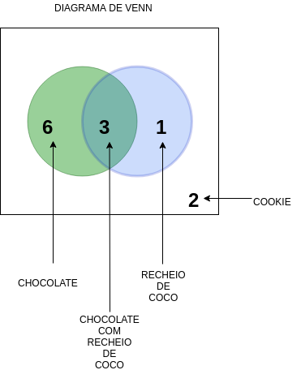

**Two-way frequency tables and Venn diagrams**( _Tabelas de frequências bidirecionais e diagramas de Venn_)

Existem 12 cookies

- Cookie de Chocolate com recheio de Coco = 3
- Cookie de Chocolate sem recheio de Coco = 6
- Cookie com recheio de Coco = 1
- Cookie Tradicional = 2

||Com Coco|Sem Coco|Total|
|-|-|-|-|
|Com Chocolate|3|6|9|
|Sem Chocolate|1|2|3|
|**Total**|**4**|**8**|**12**|

Uma forma de representar a tabela a cima é criando um diagrama de Venn. Esse diagrama consiste em apresentar um universo (retângulo) onde dois círculos ou mais representam assuntos diferentes, no exemplo abaixo, tudo que está dentro do universo é cookie, a primeira esfera representa cookies com cobertura de chocolate, enquanto o outro círculo representa cookies com recheio de coco. Quando os círculos se cruzam, eles representam a junção de todo o universo, a parte do meio significa que ele tem tudo do retângulo, e tudo dos dois círculos. Resumindo, é um cookie com recheio de coco e com cobertura de chocolate.

 

**Referencias**

[Khan Academy - Two-way frequency tables and Venn diagrams](https://www.khanacademy.org/math/ap-statistics/analyzing-categorical-ap/stats-two-way-tables/v/two-way-frequency-tables-and-venn-diagrams)
