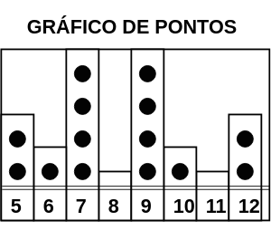

**Frequency tables & dot plots** ( _Tabelas de frequência e gráficos de pontos_)

 

**Ages of strudents in class**( _Idade de estudantes_)

|5|7|5|9|7|7|6|9|9|9|10|12|12|7|
|-|-|-|-|-|-|-|-|-|-|--|--|--|-|

Maneiras diferentes de representar esses dados

Uma meneira facil 

Tabela de frequencia

Para realizar a tabela de frequencia iremos primeiro localizar o menor e o maior numero da lista.

Menor = 5
Maior = 12

Faremos uma pequena tabela, e iremos inserir do menor valor achado ou maior, em ordem crescente. Exemplo:

Menor = 5
Maior = 12
Números a serem inseridos

**5, 6, 7, 8, 9, 10, 11, 12**

Ficaria da seguinte forma 

|Idade|Frequencia|
|-|-|
|5||
|6||
|7||
|8||
|9||
|10||
|11||
|12||

 Agora iremos inserir a frequencia de cada número da tabela, ou seja,  quantas vezes cada um deles se repetem.

|Idade|Frequencia|
|-|-|
|5|2|
|6|1|
|7|4|
|8|0|
|9|4|
|10|1|
|11|0|
|12|2|

Para ter uma melhor visualização iremos transpor aquela tabela que acabamos de ver, e iremos criar um gráfico de pontos.
O gráfico de pontos nada mais é que um grafico de barra, onde iremos informar a quantidade de vezes que determinado numero aparece, fazendo com que sua crescente seja em uma vertical.  Resumindo, quanto mais vezes o número for presente em um conjunto de dados, mais ele vai crescer.
Veja abaixo o como o grafico ficaria:

**Referencias:**

[Khan Academy - Frequency tables & dot plots](https://www.khanacademy.org/math/ap-statistics/quantitative-data-ap/frequency-tables-dot-plots/v/frequency-tables-and-dot-plots)

                                               

